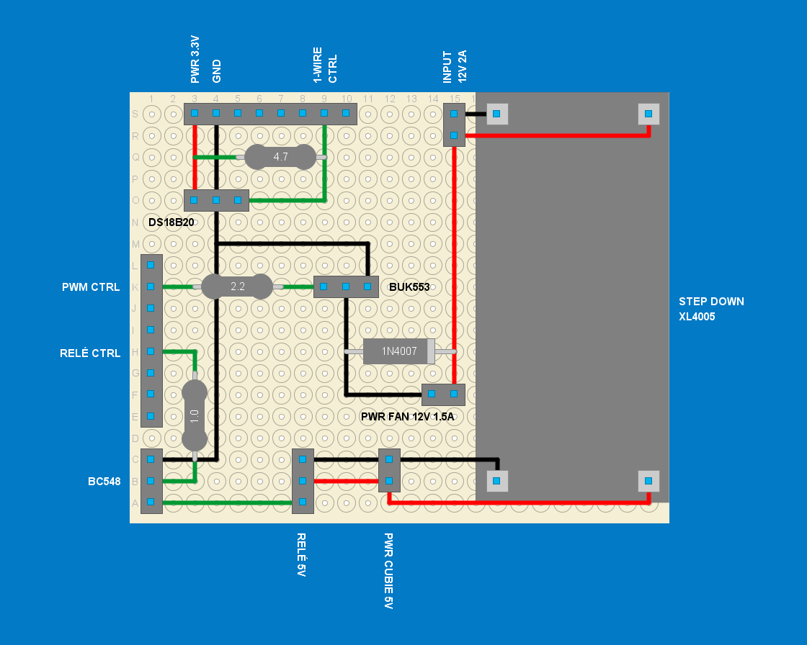

# Coolerpad

Mini projeto que implementa um sistema de refrigeração para notebooks utilizando Armbian e Cubieboard. Este sistema mede a temperatura expelida pelo exaustor do notebook e ajusta a velocidade de um cooler em intervalos de temperatura predefinidos.

Este mini projeto foi desenvolvido com o objeto de aprender e explorar a utlização de SBC (Single Board Computer). Sugestões e ideias para melhorias são sempre bem-vindas!

### Componentes
- Cubieboard executando Armbian Linux.
- Sensor de Temperatura DS18B20 para medição da temperatura expelida pelo exaustor do notebook.
- Transistor BC548 para o acionamento do módulo Relé de 5V.
- Mosfe BUK553 para ajuste da velocidade do cooler através de um sinal PWM (Pulse Width Modulation).
- Diodo 1N4007 para proteção contra corrente reversa
- Resistor 4.7 kΩ utilizado como pull-up para o sensor DS18B20
- Resistor 2.2 kΩ e 1.0 kΩ para controle de sinal
- Módulo Relé de 5V para acionamento do cooler.
- Cooler de 12V e 1.5A utilizado para a refrigeração.
- Módulo Step-Down XL4005 para a redução da 12V para 5V.
- Perfboard e Cabos.

### Esquema de Conexão

#### **BC548 (Transistor NPN)**:
| **Pino**  | **Descrição**                    | **Conexão**                                    |
|-----------|----------------------------------|------------------------------------------------|
| **C**     | Coletor                          | Conectado à entrada de sinal do módulo relé.   |
| **B**     | Base                             | Conectado ao GPIO de controle do relé via resistor de 1 kΩ. |
| **E**     | Emissor                          | Conectado ao GND.                              |

#### **BUK553 (Mosfet N-Channel)**:
| **Pino**  | **Descrição**                    | **Conexão**                                    |
|-----------|----------------------------------|------------------------------------------------|
| **G**     | Gate                             | Conectado ao GPIO de controle PWM via resistor de 2.2 kΩ. |
| **D**     | Drain                            | Conectado ao terminal negativo do ventilador.  |
| **S**     | Source                           | Conectado ao GND.                              |

#### **DS18B20 (Sensor de Temperatura)**:
| **Pino**  | **Descrição**                    | **Conexão**                                    |
|-----------|----------------------------------|------------------------------------------------|
| **VCC**   | Alimentação                      | Conectado ao 3.3V da Cubieboard.               |
| **DATA**  | Linha de Dados                   | Conectado ao GPIO configurado para One-Wire, com resistor pull-up de 4.7 kΩ para 3.3V. |
| **GND**   | Terra                            | Conectado ao GND da Cubieboard.                |

#### **1N4007 (Diodo de Proteçao)**:

| **Pino**   | **Descrição**                    | **Conexão**                                    |
|------------|----------------------------------|------------------------------------------------|
| **Anodo**  | Terminal positivo do diodo       | Conectado ao terminal negativo do ventilador (lado do Mosfet BUK553). |
| **Catodo** | Terminal negativo do diodo       | Conectado ao terminal positivo do ventilador (lado da alimentação 12V). |

### Alimentação
- A fonte de 12V alimenta o ventilador diretamente.
- O módulo step-down XL4005 reduz a tensão para 5V para alimentar o relé e a Cubieboard.
